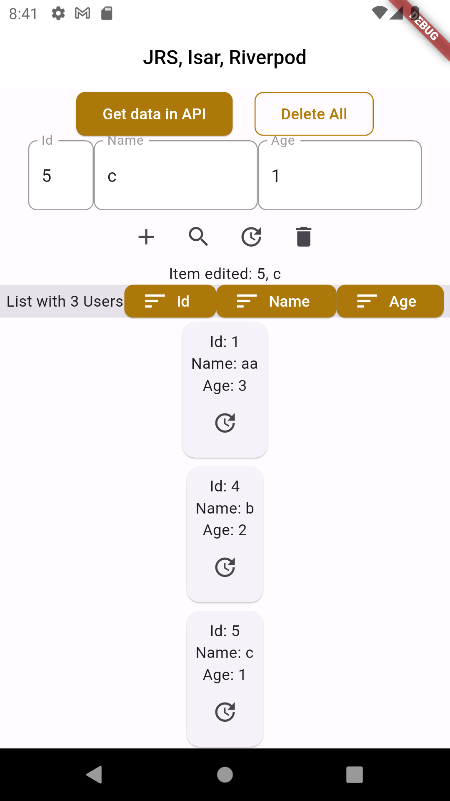

# poc_isar

Testando Package Isar 

https://pub.dev/packages/isar

# Screens

## Getting Started

catalunha@pop-os:~/myapp/pocs/poc_isar$ dart run build_runner watch -d

# history
catalunha@pop-os:~$ flutter create --project-name poc_isar --platforms android,web,linux ./poc_isar

flutter pub add isar isar_flutter_libs path_provider
flutter pub add -d isar_generator build_runner

flutter pub add \
  flutter_riverpod \
  riverpod_annotation \
  dev:riverpod_generator \
  dev:build_runner \
  dev:custom_lint \
  dev:riverpod_lint

https://medium.com/@masreplay/integrating-freezed-with-isar-for-effortless-data-management-in-flutter-df03c3e37e59